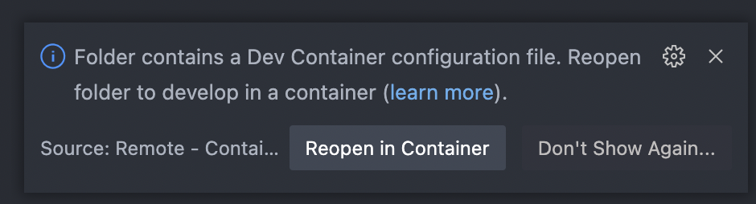

# idris2-effects
Port effects package from Idris 1 to Idris2

My learning experience with Algebraic Effects and Idris2.


## Setup and run the examples

You don't need to install Idris2 or idris2-lsp, those tools are already installed in devcontainer. All you need to setup in your computer are:

* [Docker](https://docs.docker.com/get-docker/)
* [VSCode](https://code.visualstudio.com/download)
* [Remote Development Extension Pack](https://marketplace.visualstudio.com/items?itemName=ms-vscode-remote.vscode-remote-extensionpack) for VSCode

Then checkout the code locally:

```bash
git clone https://github.com/jiwhiz/idris2-effects.git
```

In VS Code, open the project folder. Since it has dev container config, VS Code will prompt on the bottom right with:



Click "Reopen in Container" and it will download the image and open the project in a devcontainer. Make sure you have docker running locally, and see the new container running.

Open a new Terminal in VS Code, and you can check the idris2 and idris2-lsp version:

```
vscode ➜ /workspaces/idris2-effects $ idris2 --version
Idris 2, version 0.6.0-dc1b5387b
vscode ➜ /workspaces/idris2-effects $ idris2-lsp --version
Idris2 LSP: 0.1.0-7fa662a2a
Idris2 API: 0.6.0-dc1b5387b
```

You can try the examples inside Idris REPL, such as TreeLabel.idr:

```
vscode ➜ /workspaces/idris2-effects $ idris2 src/Examples/TreeLabel.idr
     ____    __     _         ___
    /  _/___/ /____(_)____   |__ \
    / // __  / ___/ / ___/   __/ /     Version 0.6.0-dc1b5387b
  _/ // /_/ / /  / (__  )   / __/      https://www.idris-lang.org
 /___/\__,_/_/  /_/____/   /____/      Type :? for help

Welcome to Idris 2.  Enjoy yourself!
1/1: Building src.Examples.TreeLabel (src/Examples/TreeLabel.idr)
Main> :exec main
[(1, "One"), (2, "Two"), (3, "Three"), (4, "Four"), (5, "Five")]Main>
```
